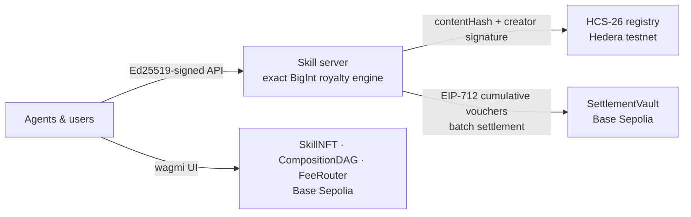

<div align="center">

# ⬡ SkillNet

### Composable AI skills with on-chain royalties

*Skills compose like Lego. Every call pays every creator in the chain — exactly, provably, to the wei.*

[](https://github.com/GaryGAO2003/skillnet/actions/workflows/ci.yml)
[](LICENSE)
[](https://sepolia.basescan.org/address/0x167A8D5B7702ABE98eCCb1579435C849B4f0f1Fd)
[](https://hashscan.io/testnet/topic/0.0.8599076)

**[Live demo](https://skillnet-demo.onrender.com)** · **[On-chain UI](https://skillnet-ten.vercel.app)** · **[Registry](https://skillnet-ten.vercel.app/registry)** · **[简体中文](README.zh-CN.md)**

</div>

---

AI agents are starting to buy capabilities from each other. SkillNet is the missing plumbing: a network where skills **register verifiably**, **compose into bundles**, and **earn recursive royalties** on every call.

- **Composition DAG** — mint a skill as an NFT, bundle skills into bundles-of-bundles; dependencies and royalty weights live on-chain.
- **Royalties that conserve** — a ρ-flow split distributes each call's fee across the entire ancestor DAG and provably sums to *exactly* the payment. Fuzz-tested invariant: `Σ credited == price`, to the wei, for diamonds and nested bundles.
- **Micropayments that actually clear** — per-call fees are sub-cent, and no chain settles that one-by-one (the gas floor alone is 2.5×+ the payment). Calls accrue off-chain as **EIP-712 cumulative vouchers** and batch-settle on-chain — **proven live: [6 sub-cent calls → 1 `settleBatch` transaction](https://sepolia.basescan.org/tx/0x6cc916a1b6b8d286a9edba71d4ce65acca22506ec911897206adeb0df4ba47d4)**, conservation enforced by the contract.
- **A registry no one can delist** — skill identity, a canonical `contentHash`, and the creator's Ed25519 signature anchor to **Hedera HCS-26**. [Browse it live](https://skillnet-ten.vercel.app/registry): every row is read straight from Hedera's public mirror node and **re-verified in your own browser** — no server in the middle.

<p align="center">
  
  
</p>

## Architecture



**Two chains, two jobs:** Hedera anchors *identity and provenance* (cheap, ordered, verifiable messages); Base settles *money* (EVM + USDC/x402 ecosystem). The server in the middle holds no trust: writes require creator signatures, and the money path is exact-integer arithmetic mirrored by the contracts.

## Live deployment (Base Sepolia · chain 84532)

| Contract | Address |
|---|---|
| SkillNFT | [`0x167A…f1Fd`](https://sepolia.basescan.org/address/0x167A8D5B7702ABE98eCCb1579435C849B4f0f1Fd) |
| CompositionDAG | [`0x8733…f9d9`](https://sepolia.basescan.org/address/0x873324449b77d66343D2A5D051bBdAd2ca0bf9d9) |
| FeeRouter | [`0x58Cb…765b`](https://sepolia.basescan.org/address/0x58Cb19d316F09E25452Bfe2c852E1deC2352765b) |
| SettlementVault | [`0xb6DE…b8B8`](https://sepolia.basescan.org/address/0xb6DECc3e5d3a4E8a0F64DdFC5Fe8A6128abeb8B8) |

Sources verified on Sourcify. Seeded with 8 skills, a 3-level composition DAG, and live paid calls whose royalty split conserves exactly on-chain. HCS-26 discovery topic: [`0.0.8599076`](https://hashscan.io/testnet/topic/0.0.8599076).

**The settlement loop runs end-to-end on testnet:** demo calls accrue into cumulative EIP-712 vouchers and a gateway service batch-settles them into the vault — see [`settleBatch` tx `0x6cc9…47d4`](https://sepolia.basescan.org/tx/0x6cc916a1b6b8d286a9edba71d4ce65acca22506ec911897206adeb0df4ba47d4) (2 vouchers, 4 creditors, exact conservation). Details in [`skill-network/demo/GATEWAY.md`](skill-network/demo/GATEWAY.md).

> The [demo server](https://skillnet-demo.onrender.com) runs on a free tier: first request after idle takes ~30–60 s to wake, and in-memory state re-seeds on redeploy. The [on-chain UI](https://skillnet-ten.vercel.app) works with any injected wallet (MetaMask) on Base Sepolia; `/vault` hosts the deposit/withdraw flow.

## Quickstart

```bash
# Contracts — 21 Foundry tests (royalty conservation, voucher settlement, fuzz invariants)
cd skill-network/contracts && forge test

# Demo server — 29 node:test tests (payment semantics, auth, persistence, settlement gateway, drift guard)
cd skill-network/demo && npm install && npm test

# Off-chain settlement demo — 200 sub-cent calls collapse into 2 on-chain batches
node skill-network/settlement/run-demo.mjs

# Run the demo locally (AUTH_MODE=dev skips request signing for local play;
# the default is signature mode, which the bundled UI supports via WebCrypto)
cd skill-network/demo && AUTH_MODE=dev node server.js
```

## Repository layout

| Path | What lives here |
|---|---|
| `skill-network/contracts/` | Foundry project — `SkillNFT`, `CompositionDAG`, `FeeRouter` (conserving ρ-flow royalties), `SettlementVault` (EIP-712 vouchers + batch settlement) |
| `skill-network/settlement/` | Off-chain accrual engine: exact BigInt royalty accounting + cumulative voucher builder |
| `skill-network/demo/` | Demo server — Ed25519-signed API, rate limiting, persistent state, live HCS-26 publishing, MCP server |
| `skill-network/frontend/` | On-chain UI (wagmi + RainbowKit, Base Sepolia) |
| `skill-network/demo-frontend/` | React UI for the demo server |
| `research/` | Why per-call on-chain settlement is uneconomic — and the voucher + batch answer |

## Security model

Every write and money endpoint requires an **Ed25519 signature** over the request (`method\npath\ntimestamp\nsha256(body)`); mutations additionally require the resource creator's registered key. The server enforces the same payment floor as `FeeRouter.sol` (`value ≥ price`, compared in exact wei). HCS-26 registrations bind a canonical manifest hash and creator signature, verified on read — legacy entries surface as `verified: false` instead of being trusted.

## Documents

| Doc | What |
|---|---|
| [`skillnet-project-document-v1.md`](skillnet-project-document-v1.md) | Original proposal |
| [`skillnet-redesign-v2.md`](skillnet-redesign-v2.md) ([中文](skillnet-redesign-v2.zh.md)) | The v1 audit — what was real, what wasn't, and the redesign |
| [`research/onchain-micropayments/report.md`](research/onchain-micropayments/report.md) | Multi-source research: the economics of sub-cent multi-recipient settlement |
| [`skill-network/demo/qa-report.md`](skill-network/demo/qa-report.md) | Browser QA of the demo under production auth (all high-severity findings fixed) |

## Roadmap

Tracked as [issues](https://github.com/GaryGAO2003/skillnet/issues). Shipped: the settlement-gateway loop (deposit → calls → vouchers → on-chain batch, [proven on testnet](https://sepolia.basescan.org/tx/0x6cc916a1b6b8d286a9edba71d4ce65acca22506ec911897206adeb0df4ba47d4)) and the [searchable registry UI](https://skillnet-ten.vercel.app/registry) with browser-side verification. In progress: real x402/USDC rails for agent-to-agent payment. Next: creator account binding (HCS-11), USDC-denominated vault.

## License

[MIT](LICENSE)
