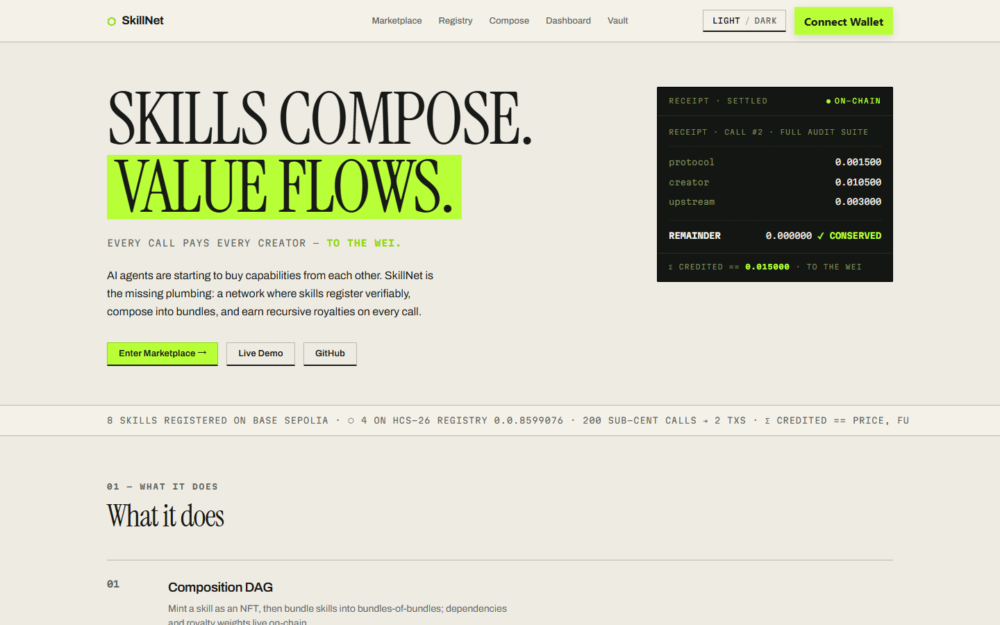
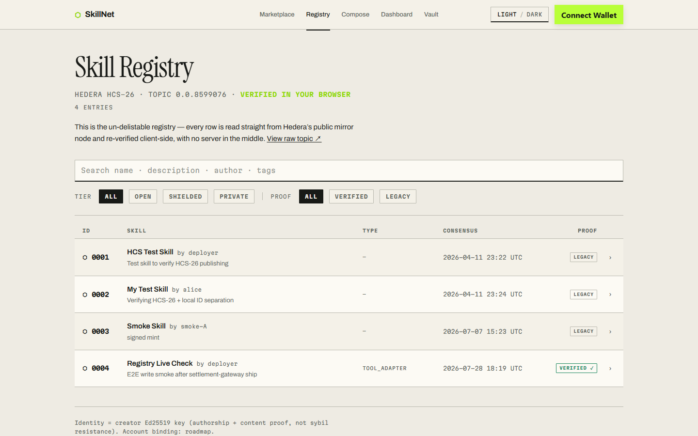
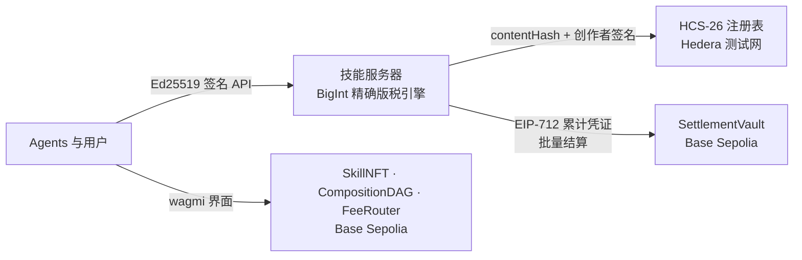

<div align="center">

# ⬡ SkillNet

### 可组合的 AI 技能网络,链上版税自动分账

*技能像乐高一样组合。每一次调用,组合链上的每一位创作者都精确分成——可证明,精确到 wei。*

[](https://github.com/GaryGAO2003/skillnet/actions/workflows/ci.yml)
[](LICENSE)
[](https://sepolia.basescan.org/address/0x167A8D5B7702ABE98eCCb1579435C849B4f0f1Fd)
[](https://hashscan.io/testnet/topic/0.0.8599076)

**[在线 Demo](https://skillnet-demo.onrender.com)** · **[链上界面](https://skillnet-ten.vercel.app)** · **[注册表](https://skillnet-ten.vercel.app/registry)** · **[English](README.md)**

</div>

---

AI agent 之间正在开始互相购买能力。SkillNet 是缺失的那段管道:一个让技能**可验证注册**、**组合成束**、并在每次调用中**递归赚取版税**的网络。

- **组合 DAG** —— 技能铸成 NFT,技能组合成束、束再组合成束;依赖关系和版税权重都在链上。
- **严格守恒的版税** —— ρ-flow 分配把每次调用的费用分给整个祖先 DAG,且可证明其总和*恰好等于*支付额。模糊测试不变量:对菱形依赖和嵌套束,`Σ 入账 == 价格`,精确到 wei。
- **真正能结清的微支付** —— 单次调用费用低于一美分,没有任何链能逐笔结算(光 gas 下限就是支付额的 2.5 倍以上)。调用在链下以 **EIP-712 累计凭证**记账,批量上链结算——**已在测试网真实跑通:[6 笔亚分调用 → 1 笔 `settleBatch` 交易](https://sepolia.basescan.org/tx/0x6cc916a1b6b8d286a9edba71d4ce65acca22506ec911897206adeb0df4ba47d4)**,守恒由合约强制。
- **无人能下架的注册表** —— 技能身份、规范化 `contentHash`、创作者 Ed25519 签名,全部锚定在 **Hedera HCS-26**。[在线浏览](https://skillnet-ten.vercel.app/registry):每一行都直接读取 Hedera 公共镜像节点,并**在你自己的浏览器里重新验证**——中间没有任何服务器。

<p align="center">
  
  
</p>

## 架构



**双链分工:** Hedera 锚定*身份与出处*(便宜、有序、可验证的消息);Base 结算*资金*(EVM + USDC/x402 生态)。中间的服务器不持有信任:写操作需要创作者签名,资金路径是与合约互为镜像的精确整数运算。

## 线上部署(Base Sepolia · chain 84532)

| 合约 | 地址 |
|---|---|
| SkillNFT | [`0x167A…f1Fd`](https://sepolia.basescan.org/address/0x167A8D5B7702ABE98eCCb1579435C849B4f0f1Fd) |
| CompositionDAG | [`0x8733…f9d9`](https://sepolia.basescan.org/address/0x873324449b77d66343D2A5D051bBdAd2ca0bf9d9) |
| FeeRouter | [`0x58Cb…765b`](https://sepolia.basescan.org/address/0x58Cb19d316F09E25452Bfe2c852E1deC2352765b) |
| SettlementVault | [`0xb6DE…b8B8`](https://sepolia.basescan.org/address/0xb6DECc3e5d3a4E8a0F64DdFC5Fe8A6128abeb8B8) |

源码已在 Sourcify 验证。链上已铸 8 个技能、一个 3 层组合 DAG,并有真实付费调用——版税分账在链上精确守恒。HCS-26 发现主题:[`0.0.8599076`](https://hashscan.io/testnet/topic/0.0.8599076)。

**结算闭环已在测试网端到端跑通:** demo 调用累积成 EIP-712 累计凭证,gateway 服务批量结算入金库——见 [`settleBatch` 交易 `0x6cc9…47d4`](https://sepolia.basescan.org/tx/0x6cc916a1b6b8d286a9edba71d4ce65acca22506ec911897206adeb0df4ba47d4)(2 张凭证、4 个受益人、精确守恒)。详见 [`skill-network/demo/GATEWAY.md`](skill-network/demo/GATEWAY.md)。

> [Demo 服务器](https://skillnet-demo.onrender.com)跑在免费档:闲置后首次访问需约 30–60 秒唤醒,重新部署时内存状态会重置为种子数据。[链上界面](https://skillnet-ten.vercel.app)支持任意插件钱包(MetaMask)连接 Base Sepolia;`/vault` 页承载存款/提现流程。

## 快速开始

```bash
# 合约 —— 21 个 Foundry 测试(版税守恒、凭证结算、模糊不变量)
cd skill-network/contracts && forge test

# Demo 服务器 —— 29 个 node:test 测试(支付语义、鉴权、持久化、结算 gateway、防漂移)
cd skill-network/demo && npm install && npm test

# 链下结算演示 —— 200 笔亚分调用压缩成 2 笔链上交易
node skill-network/settlement/run-demo.mjs

# 本地运行 demo(AUTH_MODE=dev 跳过请求签名方便本地把玩;
# 默认是签名模式,自带 UI 通过 WebCrypto 支持)
cd skill-network/demo && AUTH_MODE=dev node server.js
```

## 仓库结构

| 路径 | 内容 |
|---|---|
| `skill-network/contracts/` | Foundry 项目 —— `SkillNFT`、`CompositionDAG`、`FeeRouter`(守恒 ρ-flow 版税)、`SettlementVault`(EIP-712 凭证 + 批量结算) |
| `skill-network/settlement/` | 链下记账引擎:BigInt 精确版税累计 + 累计凭证构建 |
| `skill-network/demo/` | Demo 服务器 —— Ed25519 签名 API、限流、状态持久化、实时 HCS-26 发布、MCP 服务器 |
| `skill-network/frontend/` | 链上界面(wagmi + RainbowKit,Base Sepolia) |
| `skill-network/demo-frontend/` | Demo 服务器的 React 界面 |
| `research/` | 为什么逐笔链上结算不经济——以及凭证 + 批量结算的答案 |

## 安全模型

所有写操作和资金端点都要求对请求做 **Ed25519 签名**(`method\npath\ntimestamp\nsha256(body)`);修改已有资源还需匹配创作者注册的密钥。服务器强制与 `FeeRouter.sol` 相同的支付地板(`支付 ≥ 价格`,以精确 wei 比较)。HCS-26 注册消息绑定规范化 manifest 哈希与创作者签名,读取时验证——旧消息标记为 `verified: false` 而非被默认信任。

## 文档

| 文档 | 内容 |
|---|---|
| [`skillnet-project-document-v1.md`](skillnet-project-document-v1.md) | 最初提案 |
| [`skillnet-redesign-v2.zh.md`](skillnet-redesign-v2.zh.md)([English](skillnet-redesign-v2.md)) | v1 审计——哪些是真的、哪些不是,以及重设计 |
| [`research/onchain-micropayments/report.md`](research/onchain-micropayments/report.md) | 多源调研:亚分级多收款方结算的经济学 |
| [`skill-network/demo/qa-report.md`](skill-network/demo/qa-report.md) | 生产鉴权模式下的浏览器 QA(全部高危发现已修复) |

## 路线图

以 [issues](https://github.com/GaryGAO2003/skillnet/issues) 追踪。已交付:结算网关闭环(存款 → 调用 → 凭证 → 链上批量结算,[测试网实证](https://sepolia.basescan.org/tx/0x6cc916a1b6b8d286a9edba71d4ce65acca22506ec911897206adeb0df4ba47d4))、[可搜索注册表界面](https://skillnet-ten.vercel.app/registry)(浏览器端验证)。进行中:真实 x402/USDC 支付轨道。下一步:创作者账号绑定(HCS-11)、USDC 计价金库。

## 许可

[MIT](LICENSE)
